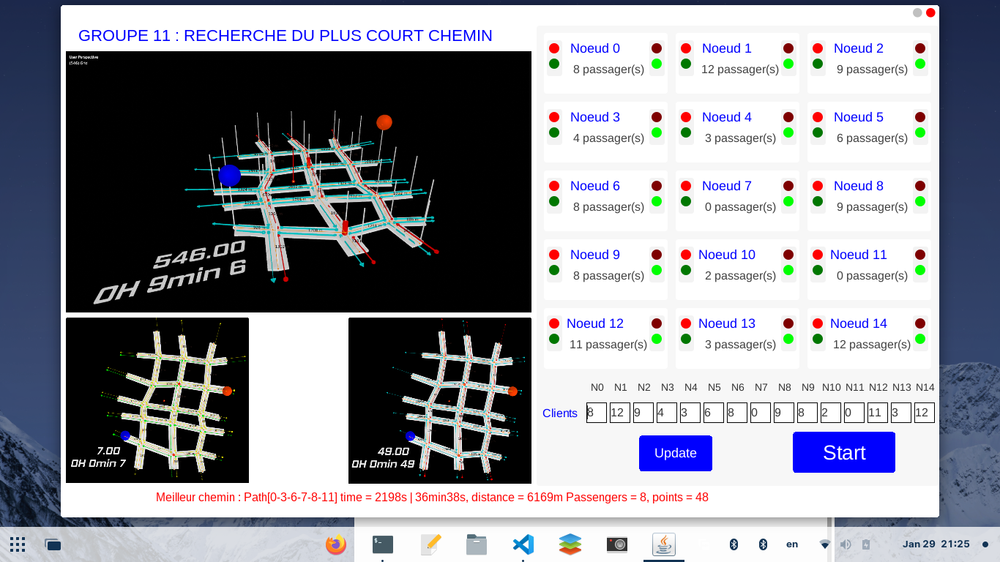

# Transportation-IOT-Platform

**Projet Systèmes Embarqués Et Temps Réel**

De nos jours la technologie occupe une place incontournable, voire même
déroutante et inséparable de notre quotidien. Le monde est de plus en plus connecté
et même les gadgets les plus simples et petits possible portent en leur sein des
systèmes d’exploitation suffisamment complexes et intelligents. L’objet de notre
projet porte sur une technologie très utilisée dans le domaine de transport et de
géolocalisation en temps réel. La recherche du chemin le plus court pour une
plateforme de transport médicale. En effet, l’application des algorithmes très
performants de guide et de conduite autonome a fait ses preuves dans la circulation
routière. Bon nombre si nous ne pouvons nous le permettre de véhicules pour des
pays suffisamment développés ainsi que les constructeurs d’automobile offrent ces
technologies embarquées qui facilitent la conduite pour leur nombreux usagers et
à la limite les guident entièrement sur tout le trajet sous une musique bien relaxante.
Nous allons sous les contraintes à notre portée aborder son usage pour une
plateforme médicale permettant de transporter un nombre de patients prédéfini à
différents nœuds (15 pour notre cas) partant d’un nœud initial vers une destination
finale.



to run the application

```bash
javac Launch.java && java Launch
```
